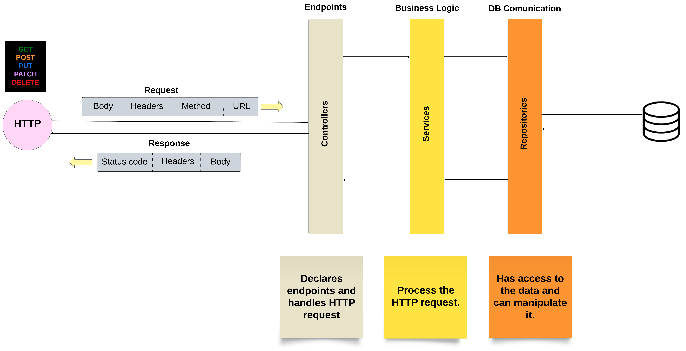
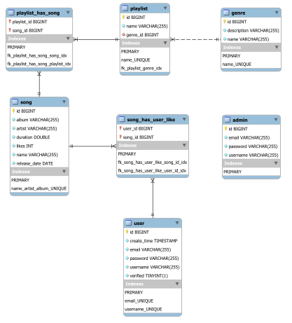

# 🔩 What's a Back-end?

As we are building a web application, we need to have a back-end and a front-end. The back-end is the part of the application that is responsible for the business logic and the front-end is the part that is responsible for the user interface.

## 🖥️ Tech Stack

-  [**Spring boot**](https://spring.io/)

-  [**MySQL**](https://www.mysql.com/)

-  [**JWT**](https://jwt.io/)
- [ **JUnit**](https://junit.org/junit5/)

# 🤔 How it works?

We are using **Spring boot** to build our back-end. Spring boot is a framework that helps us to build web applications. It is based on the Spring framework, which is a framework that helps us to build enterprise applications. Spring boot use a **MVC architecture**, which means that we have a model, a view and a controller, but we are not using the view part, because we are building a **REST API**, so we don't need to render any **HTML** pages, instead we return **JSON** objects that are consumed by the front-end.



## 🎮 Controllers

The controllers are the part of the application that is responsible for receiving the requests from the front-end and returning the responses. The controllers are the entry point of the application. The controllers are annotated with `@RestController` and the methods are annotated with `@RequestMapping` to specify the path of the endpoint and the **HTTP** method that the endpoint accepts and `@Autowired` to inject the dependencies.

```java
@RestController
@RequestMapping("/myEndpoint")
public class MyController {

    @Autowired
    private MyService myService;

    /* Methods to handle different types of request */
}
```

## 🏪 Services

The services are the part of the application that is responsible for the business logic. The services are annotated with `@Service` and the methods are annotated with `@Transactional` to specify that the method is a transaction and `@Autowired` to inject the dependencies.

```java
@Service
public class MyService {

    @Autowired
    private MyRepository myRepository;

    @Transactional
    public void myMethod() {
        /* Business logic */
    }
}
```

## 🗃️ Repositories

The repositories are the part of the application that is responsible for the communication with the database. The repositories are annotated with `@Repository` and they extend the `CrudRepository` interface.

```java
@Repository
public interface MyRepository extends CrudRepository<MyModel, Long> {
    /* Methods to query the database */
}
```

## 🦴 Models

The models are the part of the application that is responsible for the data. The models are annotated with `@Entity` and they are mapped to a table in the database. The models are also annotated with `@Data` to generate the getters and setters.

```java

@Entity
@Data
public class MyModel {

    @Id
    @GeneratedValue(strategy = GenerationType.IDENTITY)
    private Long id;

    /* Other Attributes */
}
```

# 💽 Database

We are using **MySQL** as our database. We are using **MySQL Workbench** to visualize and design the database, also with **Spring boot** we are generate the database schema from our models. We implemented some **triggers** and **stored procedures** to handle some logic directly in the database. Finally we deployed the database in **AWS RDS**.



# 📚 API reference

This section contains the documentation of the endpoints of the back-end with JSON examples to show how the requests and responses should look like.

## 🧬 Genres

Endpoints for managing genres.

### Get all genres

```http
  GET /genre/all
```

**Response**:

```json
[
  {
    "id": 1,
    "name": "Undefined",
    "description": "Not defined"
  },
  {
    "id": 2,
    "name": "Rock",
    "description": "Powerful, rhythmic genre with electric guitars, bass, drums, and vocals. Emerged in mid-20th century, diverse subgenre, explores rebellion, love, and social commentary."
  }
  //   ...
]
```

### Get genre

```http
  GET /genre/${id}
```

| Parameter | Type      | Description                       |
| :-------- | :-------- | :-------------------------------- |
| `id`      | `Integer` | **Required**. Id of item to fetch |

**Response**:

```json
{
  "id": 2,
  "name": "Rock",
  "description": "Powerful, rhythmic genre with electric guitars, bass, drums, and vocals. Emerged in mid-20th century, diverse subgenre, explores rebellion, love, and social commentary."
}
```

### Add genre

```http
  POST /genre/add
```

| Parameter | Type    | Description                 |
| :-------- | :------ | :-------------------------- |
| `genre`   | `Genre` | **Required**. Genre to add. |

**Request**:

```json
{
  "name": "Pop",
  "description": "Characterized by catchy melodies, simple song structures, and broad appeal. It often features electronic instruments and emphasizes vocals. Pop songs are known for their infectious tunes and cover various themes, from love to everyday life."
}
```

### Patch genre

```http
  PATCH /genre/patch
```

| Parameter | Type      | Description                                                                                                        |
| :-------- | :-------- | :----------------------------------------------------------------------------------------------------------------- |
| `id`      | `Integer` | **Required**. Id of the genre to be patch                                                                          |
| `genre`   | `Genre`   | **Required**. Genre to patch, a patch method expect a genre with only the attributes that are going to be modified |

**Request**:

```json
{
  "name": "new name"
  // Name before patch: "Pop"
}
```

### Update genre

```http
  PUT /genre/update/${id}
```

| Parameter | Type      | Description                                                                                                   |
| :-------- | :-------- | :------------------------------------------------------------------------------------------------------------ |
| `id`      | `Integer` | **Required**. Id of the genre to be modified                                                                  |
| `genre`   | `Genre`   | **Required**. Genre to update, an update method expect a genre with all attributes modified except for the id |

**Request**:

```json
{
  "name": "Rock",
  "description": "New description"
}
```

### Delete genre

```http
  DELETE /genre/delete/${id}
```

| Parameter | Type      | Description                        |
| :-------- | :-------- | :--------------------------------- |
| `id`      | `Integer` | **Required**. Id of item to delete |

**Response**:

```HTTP
    204 NO CONTENT
```

## 🕺 Playlists

Endpoints for managing playlists.

### Get all playlists

```http
  GET /playlist/all
```

**Response**:

```json
[
  {
    "id": 1,
    "name": "Classic rock from 80's",
    "genre": {
      "id": 2,
      "name": "Rock",
      "description": "Powerful, rhythmic genre with electric guitars, bass, drums, and vocals. Emerged in mid-20th century, diverse subgenre, explores rebellion, love, and social commentary."
    },
    "playListHasSongs": [
      // Songs
    ]
  },
  {
    "id": 2,
    "name": "Classic pop from 80's",
    "genre": {
      "id": 3,
      "name": "Pop",
      "description": "Characterized by catchy melodies, simple song structures, and broad appeal. It often features electronic instruments and emphasizes vocals. Pop songs are known for their infectious tunes and cover various themes, from love to everyday life."
    },
    "playListHasSongs": [
      // Songs
    ]
  }
  //   ...
]
```

### Get playlist

```http
  GET /playlist/${id}
```

| Parameter | Type      | Description                       |
| :-------- | :-------- | :-------------------------------- |
| `id`      | `Integer` | **Required**. Id of item to fetch |

**Response**:

```json
{
  "id": 1,
  "name": "Classic rock from 80's",
  "genre": {
    "id": 2,
    "name": "Rock",
    "description": "Powerful, rhythmic genre with electric guitars, bass, drums, and vocals. Emerged in mid-20th century, diverse subgenre, explores rebellion, love, and social commentary."
  },
  "playListHasSongs": [
    // Songs
  ]
}
```

### Add playlist

```http
  POST /playlist/add
```

| Parameter  | Type       | Description                    |
| :--------- | :--------- | :----------------------------- |
| `playlist` | `Playlist` | **Required**. Playlist to add. |

**Request**:

```json
{
  "name": "Classic rock from 80's",
  "genre": {
    "id": 2,
  },
  "playListHasSongs": [
    // Songs
  ]
}

// Or

{
  "name": "Classic rock from 80's",
  "genre": {
    "name": "Rock",
  },
  "playListHasSongs": [
    // Songs
  ]
}

```

> Note: The `playListHasSongs` attribute is not required to create a song, is optional.

### Update playlist

```http
  PUT /playlist/update
```

| Parameter  | Type       | Description                                                                                                         |
| :--------- | :--------- | :------------------------------------------------------------------------------------------------------------------ |
| `playlist` | `Playlist` | **Required**. Playlist to update, an update method expect a playlist with all attributes modified except for the id |

### Patch playlist

```http
  PATCH /playlist/patch
```

| Parameter  | Type       | Description                                                                                                              |
| :--------- | :--------- | :----------------------------------------------------------------------------------------------------------------------- |
| `playlist` | `Playlist` | **Required**. Playlist to patch, a patch method expect a playlist with only the attributes that are going to be modified |

### Delete playlist

```http
  DELETE /playlist/delete/${id}
```

| Parameter | Type      | Description                        |
| :-------- | :-------- | :--------------------------------- |
| `id`      | `Integer` | **Required**. Id of item to delete |

## 🎵 Songs

Endpoints for managing songs.

### Get all songs

```http
  GET /song/all
```

**Response**:

Returns a list of songs.

```json
[
  {
    "id": 1,
    "name": "Stairway to heaven",
    "artist": "Led Zeppelin",
    "album": "Led Zeppelin IV",
    "duration": 481.0,
    "releaseDate": "1971-11-06",
    "playListHasSongs": [
      // Playlists
    ]
  },
  {
    "id": 2,
    "name": "Back in black",
    "artist": "AC/DC",
    "album": "Back in black",
    "duration": 249.0,
    "releaseDate": "1980-07-23",
    "playListHasSongs": [
      // Playlists
    ]
  }
  // ...
]
```

### Get song

```http
  GET /song/${id}
```

| Parameter | Type      | Description                       |
| :-------- | :-------- | :-------------------------------- |
| `id`      | `Integer` | **Required**. Id of item to fetch |

**Response**:
Returns a song.

```json
{
  "id": 1,
  "name": "Stairway to heaven",
  "artist": "Led Zeppelin",
  "album": "Led Zeppelin IV",
  "duration": 481.0,
  "releaseDate": "1971-11-06",
  "playListHasSongs": [
    // Playlists
  ]
}
```

### Add song

```http
  POST /song/add
```

| Parameter | Type   | Description               |
| :-------- | :----- | :------------------------ |
| `song`    | `Song` | **Required**. Song to add |

**Request**:

```json
{
  "name": "Stairway to heaven",
  "artist": "Led Zeppelin",
  "album": "Led Zeppelin IV",
  "duration": 481.0,
  "releaseDate": "1971-11-06",
  "playListHasSongs": [
    // Playlists
  ]
}
```

> Note: The `playListHasSongs` attribute is not required to create a playlist, is optional.

### Update song

```http
  PUT /song/update
```

| Parameter | Type   | Description                                                                                                 |
| :-------- | :----- | :---------------------------------------------------------------------------------------------------------- |
| `song`    | `Song` | **Required**. Song to update, an update method expect a song with all attributes modified except for the id |

```json
{
  "name": "Stairway to heaven",
  "artist": "Led Zeppelin",
  "album": "Led Zeppelin IV",
  "duration": 481.0,
  "releaseDate": "1971-11-07",
  "likes": 2,
  "playListHasSongs": [
    // Playlists
  ]
}
```

> Note: The `playListHasSongs` attribute is not required to create a playlist, is optional.

### Patch song

```http
  PATCH /song/patch
```

| Parameter | Type   | Description                                                                                                      |
| :-------- | :----- | :--------------------------------------------------------------------------------------------------------------- |
| `song`    | `Song` | **Required**. Song to patch, a patch method expect a song with only the attributes that are going to be modified |

### Delete song

```http
  DELETE /song/delete/${id}
```

| Parameter | Type      | Description                        |
| :-------- | :-------- | :--------------------------------- |
| `id`      | `Integer` | **Required**. Id of item to delete |

**Response**:

```HTTP
    204 NO CONTENT
```